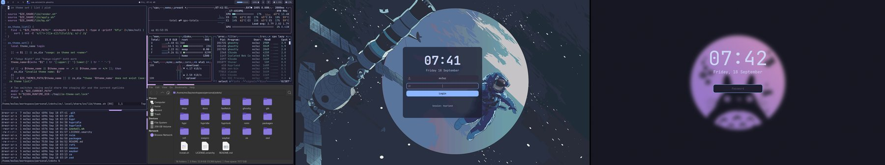
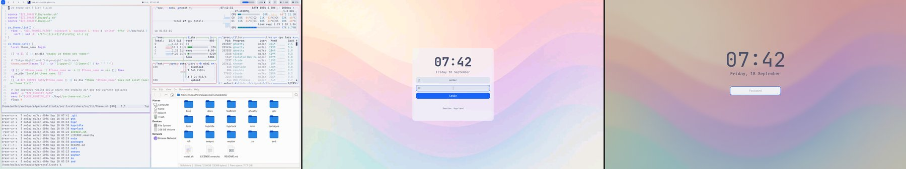
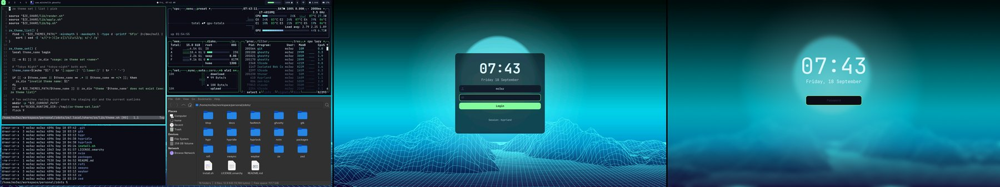
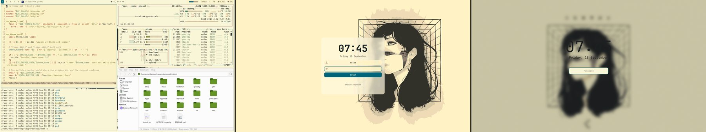
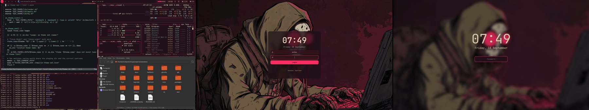
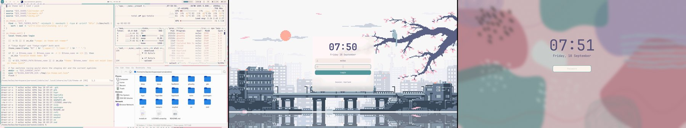
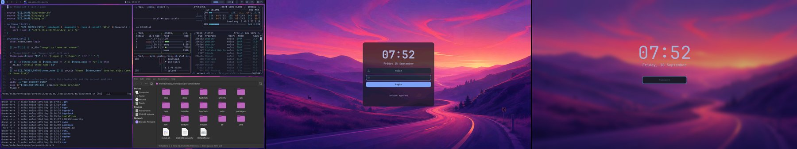

# zdots

My Arch + Hyprland desktop, plus `ze`, the command that repaints all of it.

```sh
ze theme set nord
```

That one line recolours the terminal, the bar, the launcher, notifications,
btop, GTK apps, Neovim, Zed, the browsers, the lock screen and the login
screen. It also swaps the wallpaper. 21 themes ship in the repo, most of them
from omarchy, a few of my own.

The name is short on purpose. It sounds like "the", so the commands read as
sentences: "ze theme set", "ze bg next".

## Install

Start from a fresh Arch install with a network connection and a user that can
run sudo. Plan for about 20 minutes. Most of that is pacman.

1. Clone the repo. It must stay where you clone it, because every config is a
   symlink into it.

   ```sh
   git clone https://github.com/mzloe/zdots.git ~/workspace/personal/zdots
   cd ~/workspace/personal/zdots
   ```

2. Run the installer. Pass a theme name to start with something other than
   gruvbox-light.

   ```sh
   ./install.sh
   ./install.sh tokyo-night
   ```

3. Log out and back in. SDDM shows the `ze` greeter, Hyprland starts with the
   theme applied.

The installer installs the 98 pacman packages and 7 AUR packages listed in
`packages/`, enables sddm, NetworkManager and bluetooth, links every config
into `$HOME` with GNU stow, and applies the theme. Anything already in the way
is moved to `<name>.bak.<timestamp>`, nothing is deleted. Run it again any time.
`ze install --no-packages` does the same without touching packages.

## Everyday use

| Command | Key | What happens |
| --- | --- | --- |
| `ze theme pick` | `ALT + SHIFT + T` | a carousel of theme previews. Same key again closes it |
| `ze theme set <name>` | | apply a theme. `"Tokyo Night"` and `tokyo-night` both work |
| `ze bg pick` | `ALT + SHIFT + W` | a carousel of the theme's wallpapers, then a question: Desktop, Login screen or Both |
| `ze bg next` | `SUPER + W` | next wallpaper. Add `--login` or `--both` for the login screen |
| | `SUPER + L` | lock the screen |

Also there: `ze theme list`, `ze theme current`, `ze theme sync` (pull new
themes from omarchy), `ze bg set <image> [--login|--both]` and `ze bg restore`.

In a carousel: arrows or Tab move, typing filters, Enter applies, Esc closes.

## How it works

`ze theme set` copies the theme to `~/.config/ze/current/theme/`, renders one
template per app into it, and tells each app to reload. If an app is not
installed, its step is skipped. Install it later and the next theme set paints
it too. The full walk-through, app by app, is in
[docs/theming.md](docs/theming.md).

## Previews

Desktop with rofi, the SDDM greeter, then hyprlock. All three come from the
same `ze theme set`, captured in a headless compositor.

| | |
| --- | --- |
| catppuccin  | catppuccin-latte  |
| cyberpunk  | gruvbox-light  |
| post-apocalyptic-hacker  | rose-pine  |
| tokyo-night  | |

## Make it yours

Adding a wallpaper to a theme is a copy into one of two folders:
`backgrounds/<theme>/` for your own (shows in the picker at once) or
`themes/<theme>/backgrounds/` to ship it with the theme (shows after the next
`ze theme set`). Adding a theme is a directory with a `colors.toml` and a
`backgrounds/` folder. Theming another app is one template file and one
include line. Pulling omarchy's new themes is `ze theme sync`. Step by step
for all four, plus how this theme set differs from omarchy's, is in
[docs/customizing.md](docs/customizing.md).

## Credits

- [omarchy](https://github.com/omacom/omarchy) by David Heinemeier Hansson.
  The theme format, the themes, the colour resolver, the template renderer
  and the image carousel started there. MIT licensed.
- [sddm-astronaut-theme](https://github.com/Keyitdev/sddm-astronaut-theme)
  by Keyitdev. The `ze` greeter and its icons are derived from it, and so are
  a handful of wallpapers. GPL-3.0-or-later, same as this repo.

## License

GPL-3.0-or-later, see [LICENSE](LICENSE).
